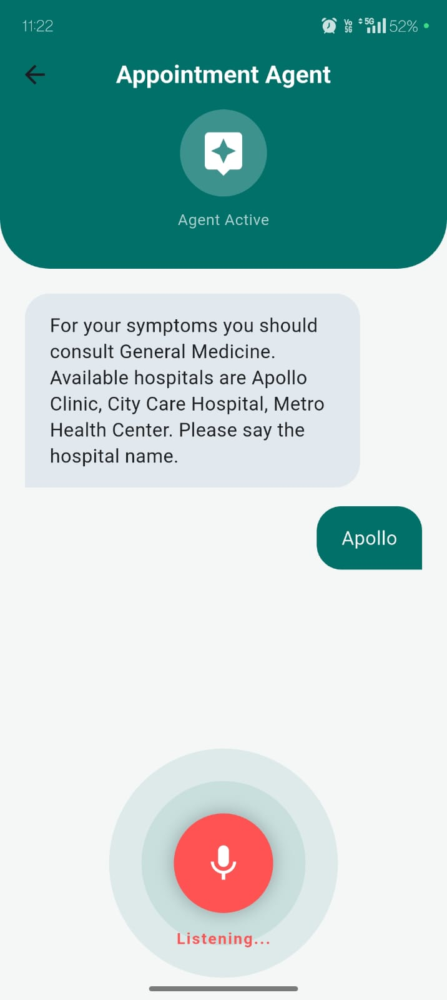
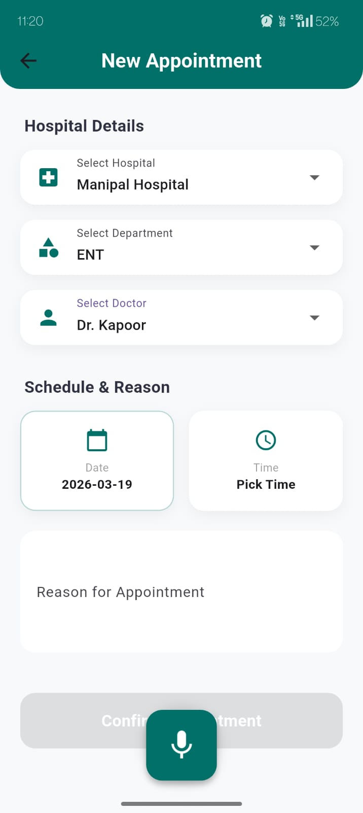
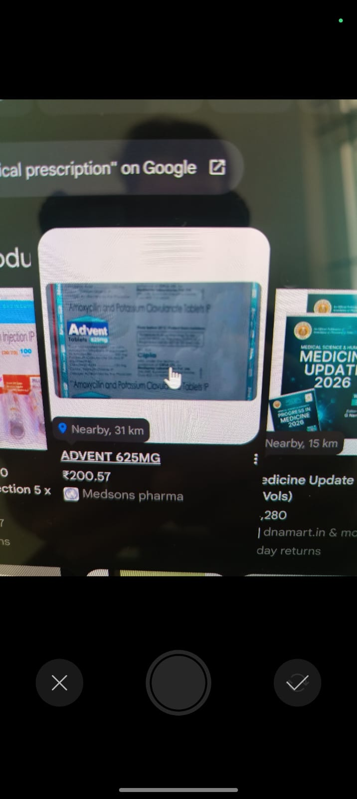
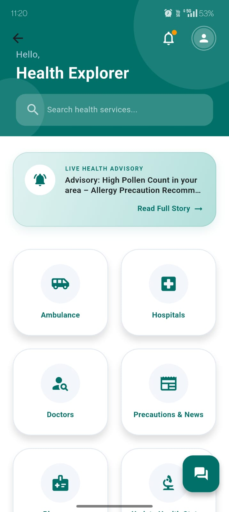
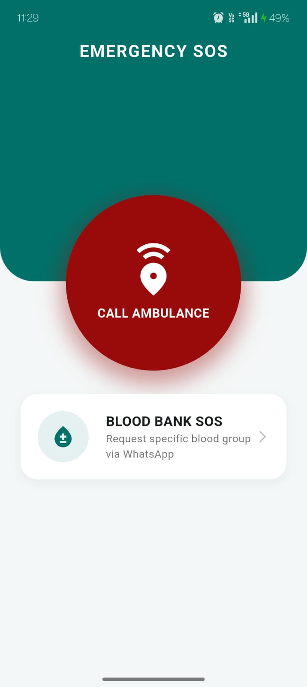
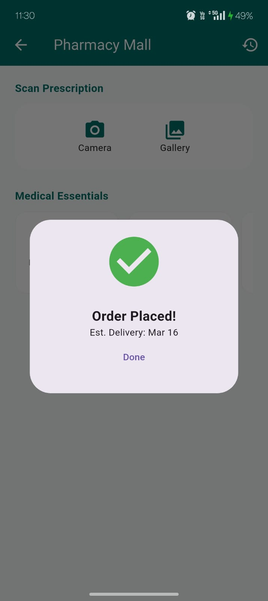
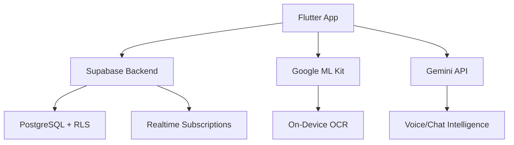

# 📱 MedFlow: Patient Mobile Experience

> **A comprehensive healthcare suite designed to digitize the patient experience. Featuring AI Voice Agents, Smart Appointments, and OCR Document Intelligence, MedFlow puts hospital resources directly into the patient's hands.**

<p align="center">
  <a href="#-features"><strong>Features</strong></a> ·
  <a href="#-demo--screenshots"><strong>Demo</strong></a> ·
  <a href="#-tech-stack"><strong>Tech Stack</strong></a> ·
  <a href="#-quick-start"><strong>Quick Start</strong></a> ·
  <a href="#-architecture"><strong>Architecture</strong></a> ·
  <a href="#-security"><strong>Security</strong></a>
</p>

<p align="center">
  
  
  
</p>

---

## 🎬 Live Demo

<p align="center">
  
  <br/>
  <em>✨ Navigate appointments, scan prescriptions & get AI help — all hands-free</em>
</p>

---

## ✨ Core Features

### 🎙️ AI Voice Concierge & Chatbot
| Feature | Impact |
|---------|--------|
| **Hands-Free Navigation** | Patients book appointments, check symptoms & navigate UI using natural voice commands |
| **24/7 Smart Triage** | LLM-powered chatbot answers FAQs, escalates urgent cases, and reduces front-desk load by ~40% |
| **Multilingual Support** | Voice & text interfaces adapt to regional languages for inclusive access |

### 📅 Smart Appointment System
| Feature | Impact |
|---------|--------|
| **Context-Aware Routing** | Tiered flow: Hospital → Department → Doctor → Slot, with real-time availability sync |
| **Zero Double-Booking** | Supabase realtime subscriptions ensure slot locking across web + mobile clients |
| **Smart Reminders** | Push notifications + SMS fallback for upcoming visits & pre-appointment prep |

### 📄 Document Intelligence (OCR)
| Feature | Impact |
|---------|--------|
| **Prescription Digitization** | Google ML Kit OCR extracts medicine names, dosages & instructions from physical scripts |
| **Medical Camera UI** | Auto-edge detection, glare reduction & perspective correction for clinical-grade scans |
| **Structured Output** | Parsed data auto-fills medication logs & shares securely with connected providers |

### 🚑 Emergency & Critical Care
| Feature | Impact |
|---------|--------|
| **One-Tap SOS** | Broadcasts GPS location + patient profile to nearest emergency response team |
| **Ambulance Dispatch** | Integrated booking with ETA tracking & driver communication |
| **Offline First-Aid** | Downloadable step-by-step guides for cardiac, trauma & pediatric emergencies |

### 💊 Wellness & Pharmacy Integration
| Feature | Impact |
|---------|--------|
| **Smart Pharmacy Finder** | Geolocated directory with real-time stock checks & prescription transfer |
| **Health Tracker** | Log vitals, medications & diet; visualize trends with interactive charts |
| **Personalized Insights** | AI-generated wellness tips based on appointment history & tracked metrics |

---

## 📸 Demo & Screenshots

> 💡 **Note**: All static screenshots use `.jpeg` format. Demo animation uses `.gif`.

<p align="center">
  <table>
    <tr>
      <td align="center"><strong>🎙️ AI Voice Concierge</strong><br/></td>
      <td align="center"><strong>📅 Smart Booking</strong><br/></td>
      <td align="center"><strong>📄 OCR Scanner</strong><br/></td>
    </tr>
    <tr>
      <td align="center"><strong>🏠 Patient Dashboard</strong><br/></td>
      <td align="center"><strong>🚨 Emergency SOS</strong><br/></td>
      <td align="center"><strong>💊 Pharmacy Finder</strong><br/></td>
    </tr>
  </table>
</p>

---

## ⚙️ Tech Stack



| Layer | Technology |
|-------|-----------|
| **Framework** | Flutter 3.x, Dart 3.x, Provider/Riverpod for state |
| **AI/ML** | Google ML Kit (OCR), Gemini API (voice/chat), on-device TTS/STT |
| **Backend** | Supabase (Auth, Postgres, Realtime, Storage) |
| **Maps/Location** | Google Maps SDK, Geolocator, Permission Handler |
| **Notifications** | Firebase Cloud Messaging + Local Notifications |
| **DevOps** | Flutter Flavor config, Fastlane (optional), GitHub Actions |

---

## 🏗️ Architecture & Key Modules

```
lib/
├── main.dart                      # App entry + Supabase init
├── core/
│   ├── services/                  # api_service.dart, auth_service.dart
│   ├── utils/                     # ocr_helper.dart, voice_processor.dart
│   └── widgets/                   # reusable: SOSButton, MedicationCard
├── features/
│   ├── auth/                      # login, onboarding, biometric setup
│   ├── dashboard/                 # patient_hub.dart, vitals_chart.dart
│   ├── appointments/              # booking_flow.dart, slot_picker.dart
│   ├── ocr/                       # text_recognition_page.dart, camera_overlay.dart
│   ├── emergency/                 # sos_trigger.dart, ambulance_tracker.dart
│   └── pharmacy/                  # finder_map.dart, stock_checker.dart
└── models/                        # patient.dart, appointment.dart, prescription.dart
```

| Module | Key File | Responsibility |
|--------|----------|---------------|
| **Identity & Auth** | `patient_end.dart` | Secure onboarding, biometric login, session management |
| **Patient Hub** | `dashboard.dart` | Central UI: vitals, upcoming visits, quick actions |
| **Prescription AI** | `text_recognition_page.dart` | OCR pipeline: capture → preprocess → extract → structure |
| **Voice Engine** | `voice_agent.dart` | STT → intent parsing → Gemini API → TTS response loop |
| **Emergency Core** | `sos_module.dart` | Location broadcast, alert escalation, offline fallback |
| **Notifications** | `notif.dart` | Appointment reminders, medication alerts, system updates |

---

## 🔐 Security & Compliance

✅ **End-to-End Encryption**: All patient data transmitted via HTTPS + Supabase SSL tunnels  
✅ **Row Level Security (RLS)**: PostgreSQL policies enforce `auth.uid() = patient_id` for all queries  
✅ **On-Device Processing**: OCR & voice inference run locally where possible — sensitive data never leaves the device unnecessarily  
✅ **Audit Logging**: All appointment changes, SOS triggers & data exports logged with timestamp + device fingerprint  
✅ **Consent-First Design**: Explicit patient consent required before sharing records with providers or AI services  

> ⚠️ **Disclaimer**: This is a hackathon prototype. Not certified for clinical diagnosis or emergency medical use. Always consult licensed healthcare professionals.

---

## 🚀 Quick Start / Local Setup

### Prerequisites
- Flutter SDK ≥ 3.0.0 (`flutter doctor -v`)
- Android Studio / Xcode for emulators
- Supabase project (free tier OK)
- Google Gemini API key (for AI features)

### Step-by-Step

```bash
# 1️⃣ Clone & navigate
git clone https://github.com/your-username/Built-for-Bengaluru.git  
cd Built-for-Bengaluru/MedFlow_Mobile_App

# 2️⃣ Install dependencies
flutter pub get

# 3️⃣ Configure environment
# Option A: Use flutter_dotenv
cp .env.example .env
# Edit .env:
#   SUPABASE_URL=your_project_url
#   SUPABASE_ANON_KEY=your_anon_key
#   GEMINI_API_KEY=your_gemini_key

# Option B: Hardcode in lib/config/constants.dart (dev only)

# 4️⃣ Platform setup (if using Firebase features)
# Android: place google-services.json in android/app/
# iOS: place GoogleService-Info.plist in ios/Runner/

# 5️⃣ Run the app
flutter run
```

### 🎯 Run on Specific Device
```bash
# List connected devices
flutter devices

# Run on Android emulator
flutter run -d emulator-5554

# Run on iOS simulator
flutter run -d iPhone-15-Pro
```

### 🔧 Troubleshooting Tips
```bash
# Clean build artifacts
flutter clean && flutter pub get

# Check Supabase connection
# → Visit Settings > API in your Supabase dashboard

# OCR not working?
# → Ensure ML Kit dependencies are updated in pubspec.yaml
# → Check camera permissions in AndroidManifest.xml / Info.plist
```

---

## 🧪 Testing & Quality

```bash
# Run unit & widget tests
flutter test

# Integration test (requires emulator)
flutter test integration_test/app_test.dart

# Analyze code quality
flutter analyze

# Format code
dart format .

# Build release APK
flutter build apk --release

# Build iOS archive
flutter build ios --release
```

---

## 🤝 Contributing

Hackathon collaborators welcome! 🙌

1. Fork the repo
2. Create feature branch: `git checkout -b feat/voice-multilingual`
3. Commit: `git commit -m '✨ Add Hindi voice support'`
4. Push: `git push origin feat/voice-multilingual`
5. Open PR with screenshots + test notes

> 📝 Follow [Flutter Style Guide](https://github.com/flutter/flutter/wiki/Style-guide-for-Flutter-repo) & use conventional commits.

---

## 🏆 Built for Bengaluru Hackathon

<p align="center">
  
</p>

**Team**: `@your-handle` • `@teammate-handle` • `@another-handle`  
**Track**: HealthTech / AI for Social Good  
**Submission**: March 2024  
**Demo Video**: [Link to Loom/YouTube]  

---

## 📄 License

Distributed under the MIT License. See [`LICENSE`](../LICENSE) for details.

> ⚠️ **Important**: Prototype for demonstration purposes only. Not intended for production clinical use without HIPAA/GDPR compliance review, medical validation, and regulatory approval.

---

<p align="center">
  <strong>Made with ❤️ for empowered patients</strong><br/>
  <sub>📱 MedFlow Mobile • Healthcare, simplified — one tap at a time</sub>
</p>

---

> 💬 **Ready to see the full ecosystem?**  
> 👉 Check out the [🏥 MedFlow Web Command Center](../MedFlow_Web_App/README.md) for the administrator view.  
> 🔗 Together, they form a unified hospital-patient intelligence platform.

---

## 📁 Screenshot Reference (Mobile)

```
MedFlow_Mobile_App/
├── screenshots/
│   ├── demo.gif              # 🎬 Hero animation (10-sec walkthrough)
│   ├── dashboard.jpeg        # 🏠 Patient home screen
│   ├── booking.jpeg          # 📅 Appointment booking flow
│   ├── ocr_scanner.jpeg      # 📄 Prescription OCR interface
│   ├── voice_agent.jpeg      # 🎙️ AI voice concierge UI
│   ├── sos.jpeg              # 🚨 Emergency SOS screen
│   ├── pharmacy.jpeg         # 💊 Pharmacy finder map
│   └── hackathon-badge.png   # 🏆 Event badge (PNG for logo)
├── README.md                 # ← This file
├── lib/
├── pubspec.yaml
└── ...
```
