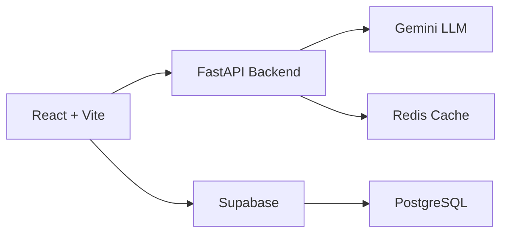

# 🏥 MedFlow: Web Command Center

> **A next-generation executive dashboard built to optimize bed inventory, track patient triage, and allocate resources efficiently using real-time data and LLM-driven insights.**

<p align="center">
  <a href="#-features"><strong>Features</strong></a> ·
  <a href="#-demo--screenshots"><strong>Demo</strong></a> ·
  <a href="#-tech-stack"><strong>Tech Stack</strong></a> ·
  <a href="#-quick-start"><strong>Quick Start</strong></a> ·
  <a href="#-project-structure"><strong>Project Structure</strong></a> ·
  <a href="#-contributing"><strong>Contributing</strong></a>
</p>

---

## 🎬 Animation / Live Demo

<p align="center">
  
  <br/>
  <em>✨ Watch MedFlow predict capacity bottlenecks in real-time</em>
</p>


## ✨ Features

### 🤖 AI-Driven Executive Overview
| Feature | Description |
|---------|-------------|
| **Intelligent Insights** | Connects to custom FastAPI predictive engine to analyze network capacity & forecast demand |
| **Automated Threat Detection** | LLM-parsed data instantly flags hospitals at ≥100% capacity with visual "🔴 Critical" alerts |
| **Smart Caching** | Uses `sessionStorage` for LLM outputs → lightning-fast loads + reduced API costs |

### 🛏️ Hierarchical Bed Inventory
| Feature | Description |
|---------|-------------|
| **Drill-Down Architecture** | Start with org-wide view → click into departments → inspect individual ward beds |
| **Real-Time Status Sync** | Toggle bed states: `🟢 Available` / `🔴 Occupied` / `🟡 Needs Cleaning` |
| **Dynamic Metrics** | Occupancy % auto-recalculates based on active filters & view depth |

### 🏥 Patient Admissions & Staff Routing
| Feature | Description |
|---------|-------------|
| **Walk-In Management** | Onboard patients in 3 clicks: assign department, set triage priority, allocate bed |
| **Staff Duty Tracking** | Clock staff `On Duty` / `Off Duty` with timestamp audit logs |
| **Secure Multi-Tenancy** | Isolated sessions per hospital org with role-based access control |

---

## 📸 Demo & Screenshots

<details open>
<summary><strong>🎛️ Executive Dashboard & AI Predictions</strong></summary>


*Real-time occupancy heatmaps + AI-generated risk forecasts*

</details>

<details>
<summary><strong>🛏️ Bed Inventory Drill-Down</strong></summary>


*Click any department to view granular bed-level status*

</details>

<details>
<summary><strong>🔐 Secure Organization Authentication</strong></summary>


*Multi-tenant onboarding with Supabase Auth + RBAC*

</details>

---

## ⚙️ Tech Stack



| Layer | Technology |
|-------|-----------|
| **Frontend** | React 18, TypeScript, Tailwind CSS, Framer Motion |
| **Backend** | FastAPI, Python 3.11, Pydantic, Uvicorn |
| **Database** | Supabase (PostgreSQL + Realtime subscriptions) |
| **AI/ML** | Google Gemini API, custom capacity-forecasting model |
| **Auth** | Supabase Auth + JWT + Row Level Security |
| **DevOps** | Docker, GitHub Actions, Vercel (frontend), Render (backend) |

---

## 🚀 Quick Start / Local Setup

### Prerequisites
- Node.js ≥18.x
- Python ≥3.11
- Supabase project (free tier works)
- Google Gemini API key

### Step-by-Step

```bash
# 1️⃣ Clone & navigate
git clone https://github.com/your-username/Built-for-Bengaluru.git
cd Built-for-Bengaluru/MedFlow_Web_App

# 2️⃣ Install frontend dependencies
npm install

# 3️⃣ Configure environment variables
cp .env.example .env
# → Edit .env with your keys:
#   VITE_SUPABASE_URL=your_project_url
#   VITE_SUPABASE_ANON_KEY=your_anon_key  
#   VITE_GEMINI_API_KEY=your_gemini_key
#   VITE_API_BASE_URL=http://localhost:8000  # for local backend

# 4️⃣ Start development server
npm run dev
```

> ✅ App will launch at `http://localhost:5173` — hot-reload enabled!

### 🔧 Running the Backend (Optional for Full Stack)

```bash
# In separate terminal
cd ../MedFlow_API
python -m venv venv
source venv/bin/activate  # Windows: venv\Scripts\activate
pip install -r requirements.txt
uvicorn main:app --reload
```

---

## 📁 Project Structure

```
MedFlow_Web_App/
├── public/
│   ├── demo.gif          # 🎬 Hero animation for README & onboarding
│   └── favicon.svg
├── src/
│   ├── components/       # Reusable UI: BedCard, AlertBanner, StatWidget
│   ├── pages/            # Route views: Dashboard, Inventory, Admissions
│   ├── services/         # API clients: supabase.ts, gemini.ts, api.ts
│   ├── store/            # State: occupancyStore.ts, authStore.ts (Zustand)
│   ├── utils/            # Helpers: formatters.ts, cache.ts, validators.ts
│   └── App.tsx
├── .env.example          # Template for environment variables
├── package.json
├── vite.config.ts
└── README.md             # ← You are here!
```

---

## 🧪 Testing & Quality

```bash
# Run unit tests
npm run test

# Type checking
npm run typecheck

# Lint & format
npm run lint
npm run format

# Build for production
npm run build
```

---

## 🤝 Contributing

We welcome hackathon collaborators! 🙌

1. Fork the repo
2. Create your feature branch: `git checkout -b feat/AmazingFeature`
3. Commit changes: `git commit -m '✨ Add AmazingFeature'`
4. Push to branch: `git push origin feat/AmazingFeature`
5. Open a Pull Request

> 📝 Please follow our [Conventional Commits](https://www.conventionalcommits.org/) style.

---

## 🏆 Built for Bengaluru Hackathon

<p align="center">
  
</p>

**Team**: `@your-handle` • `@teammate-handle` • `@another-handle`  
**Track**: HealthTech / AI for Social Good  
**Submission Date**: March 2024

---

## 📄 License

Distributed under the MIT License. See [`LICENSE`](./LICENSE) for more information.

> ⚠️ **Note**: This is a hackathon prototype. Not intended for production clinical use without thorough validation, HIPAA compliance review, and medical oversight.

---

<p align="center">
  <strong>Made with ❤️ for smarter healthcare</strong><br/>
  <sub>🏥 MedFlow • Optimizing hospital operations, one bed at a time</sub>
</p>