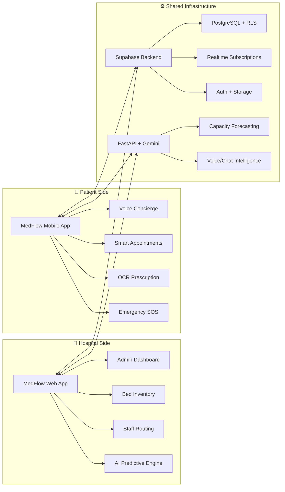
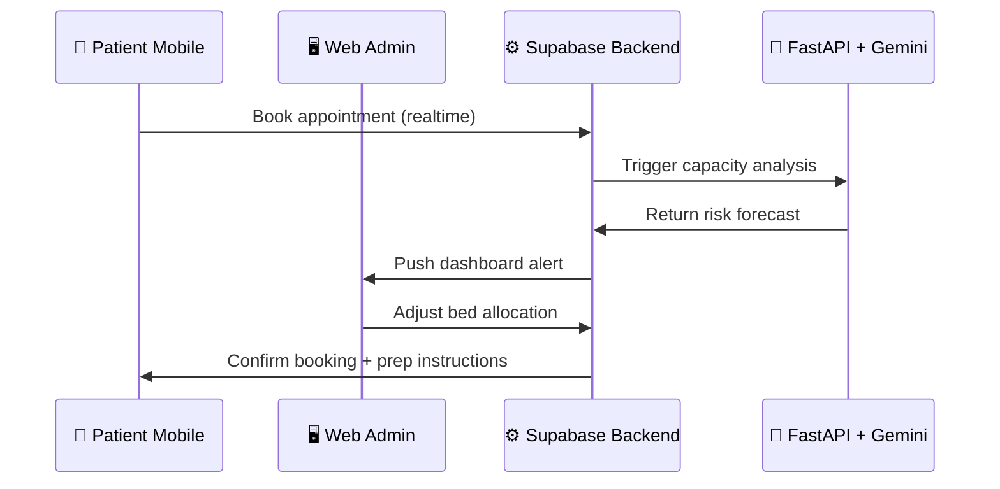
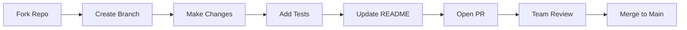

# 🏥 MedFlow: Complete Healthcare Ecosystem

> **A unified hospital-patient intelligence platform that bridges administrative command centers with patient mobile experiences. Powered by real-time data, LLM-driven insights, and AI voice/OCR capabilities.**

<p align="center">
  <a href="#-ecosystem-overview"><strong>Overview</strong></a> ·
  <a href="#-live-demos"><strong>Demos</strong></a> ·
  <a href="#-architecture"><strong>Architecture</strong></a> ·
  <a href="#-features-matrix"><strong>Features</strong></a> ·
  <a href="#-quick-start"><strong>Quick Start</strong></a> ·
  <a href="#-hackathon-submission"><strong>Submission</strong></a>
</p>

<p align="center">
  
  
  
  
</p>

---

## 🌐 Ecosystem Overview



> ✨ **The Magic**: When a patient books an appointment via mobile → Supabase realtime syncs to the web dashboard → AI engine predicts capacity impact → Admins get proactive alerts. **One ecosystem, zero friction.**

---

## 🎬 Live Demos

### 🖥️ Web Command Center (Administrators)
<p align="center">
  
  <br/>
  <em>🏥 Real-time bed tracking + AI bottleneck predictions</em>
</p>

### 📱 Patient Mobile Experience
<p align="center">
  
  <br/>
  <em>🗣️ Voice booking + 📄 OCR scanning + 🚨 One-tap SOS</em>
</p>

> 💡 **Judge Pro Tip**: Watch how a mobile appointment booking instantly updates the web dashboard's occupancy metrics — that's the power of our realtime Supabase sync.

---

## ✨ Features Matrix

| Capability | 🖥️ Web App (Admins) | 📱 Mobile App (Patients) | 🔗 Shared Intelligence |
|------------|-------------------|------------------------|----------------------|
| **🤖 AI Insights** | Capacity forecasting, critical alerts | Voice triage, symptom checker | Unified Gemini API layer |
| **🛏️ Bed Management** | Hierarchical inventory, status toggles | View availability during booking | Realtime Supabase sync |
| **📅 Appointments** | Staff scheduling, ward allocation | Tiered booking, smart reminders | Conflict prevention engine |
| **📄 Document AI** | — | OCR prescription parsing | Structured data pipeline |
| **🚨 Emergency** | Dispatch coordination | One-tap SOS + location broadcast | Geofenced alert routing |
| **🔐 Security** | RBAC, multi-tenant isolation | Biometric auth, RLS policies | End-to-end encryption |
| **📊 Analytics** | Occupancy heatmaps, trend forecasts | Personal health trends | Unified data warehouse |

---

## 🏗️ System Architecture



### 🔗 How They Communicate

| Event | Mobile → Web Sync | Web → Mobile Sync |
|-------|------------------|------------------|
| **Appointment Booked** | ✅ Realtime occupancy update | ✅ Confirmation + prep checklist |
| **Bed Status Changed** | ✅ Availability refresh | ✅ Waitlist notification |
| **Emergency SOS** | ✅ Alert admin dashboard | ✅ Dispatch ETA + first-aid guide |
| **Prescription Scanned** | ✅ Add to patient record | ✅ Medication reminders |
| **AI Prediction Triggered** | ✅ Admin alert panel | ✅ Patient wellness tip |

---

## 📸 Unified Screenshots

<p align="center">
  <table>
    <tr>
      <td align="center"><strong>🖥️ Admin Dashboard</strong><br/></td>
      <td align="center"><strong>📱 Patient Home</strong><br/></td>
    </tr>
    <tr>
      <td align="center"><strong>🛏️ Bed Inventory (Web)</strong><br/></td>
      <td align="center"><strong>📅 Booking Flow (Mobile)</strong><br/></td>
    </tr>
    <tr>
      <td align="center"><strong>🤖 AI Alerts Panel</strong><br/></td>
      <td align="center"><strong>📄 OCR Scanner</strong><br/></td>
    </tr>
  </table>
</p>

---

## ⚙️ Tech Stack Overview

| Layer | Web App | Mobile App | Shared Backend |
|-------|---------|------------|---------------|
| **Framework** | React 18 + Vite + TS | Flutter 3.x + Dart | FastAPI (Python 3.11) |
| **State Mgmt** | Zustand + Context | Provider/Riverpod | — |
| **UI Library** | Tailwind CSS + Framer Motion | Material 3 + Custom Widgets | — |
| **AI/ML** | Gemini API (predictions) | Gemini + ML Kit (voice/OCR) | Unified prompt engineering |
| **Database** | — | — | Supabase (PostgreSQL + Realtime) |
| **Auth** | Supabase Auth + JWT | Supabase Auth + Biometrics | Row Level Security (RLS) |
| **Storage** | — | — | Supabase Storage (images/docs) |
| **DevOps** | Vercel + GitHub Actions | Fastlane + GitHub Actions | Render + Docker |

---

## 🚀 Quick Start: Full Stack Setup

### 📋 Prerequisites
```bash
# Core
Node.js ≥ 18.x    | Flutter SDK ≥ 3.0.x    | Python ≥ 3.11
npm/yarn          | Android Studio/Xcode   | pip + virtualenv

# Accounts (Free Tiers OK)
✅ Supabase Project  ✅ Google Gemini API Key  ✅ (Optional) Firebase for mobile push
```

### 🔧 Step 1: Clone & Configure
```bash
# Clone the monorepo
git clone https://github.com/your-username/Built-for-Bengaluru.git
cd Built-for-Bengaluru

# Copy environment templates
cp MedFlow_Web_App/.env.example MedFlow_Web_App/.env
cp MedFlow_Mobile_App/.env.example MedFlow_Mobile_App/.env
cp MedFlow_API/.env.example MedFlow_API/.env
```

### 🔑 Step 2: Configure Shared Credentials
Edit all three `.env` files with:
```env
# Supabase (from your project dashboard)
VITE_SUPABASE_URL=your_project_url      # Web
SUPABASE_URL=your_project_url           # Mobile + API
VITE_SUPABASE_ANON_KEY=your_anon_key    # Web
SUPABASE_ANON_KEY=your_anon_key         # Mobile + API

# AI Services
VITE_GEMINI_API_KEY=your_gemini_key     # Web
GEMINI_API_KEY=your_gemini_key          # Mobile + API

# API Base URL (for local dev)
VITE_API_BASE_URL=http://localhost:8000 # Web
API_BASE_URL=http://10.0.2.2:8000       # Mobile (Android emulator)
```

### 🖥️ Step 3: Launch the Web Command Center
```bash
cd MedFlow_Web_App
npm install
npm run dev
# → Opens at http://localhost:5173
```

### 📱 Step 4: Launch the Patient Mobile App
```bash
cd ../MedFlow_Mobile_App
flutter pub get
flutter run
# → Launches on connected emulator/device
```

### ⚙️ Step 5: (Optional) Run the AI Backend Locally
```bash
cd ../MedFlow_API
python -m venv venv
source venv/bin/activate  # Windows: venv\Scripts\activate
pip install -r requirements.txt
uvicorn main:app --reload
# → API available at http://localhost:8000/docs
```

> ✅ **Success Check**: Book an appointment on mobile → Watch the web dashboard update instantly. That's the MedFlow magic! 🎯

---

## 📁 Repository Structure

```
Built-for-Bengaluru/
├── README.md                          # ← You are here! (Master Guide)
├── LICENSE
│
├── 🖥️ MedFlow_Web_App/               # Administrator Command Center
│   ├── README.md                      # Detailed web setup guide
│   ├── demo.gif                       # Hero animation
│   ├── src/
│   │   ├── components/                # BedCard, AlertBanner, StatWidget
│   │   ├── pages/                     # Dashboard, Inventory, Admissions
│   │   └── services/                  # supabase.ts, gemini.ts, api.ts
│   ├── package.json
│   └── vite.config.ts
│
├── 📱 MedFlow_Mobile_App/            # Patient Mobile Experience
│   ├── README.md                      # Detailed mobile setup guide
│   ├── demo.gif                       # Hero animation
│   ├── lib/
│   │   ├── features/                  # appointments/, ocr/, emergency/
│   │   ├── core/                      # services/, utils/, widgets/
│   │   └── main.dart                  # App entry + Supabase init
│   ├── pubspec.yaml
│   └── android/ios/                   # Platform configs
│
└── ⚙️ MedFlow_API/                   # Shared AI + Business Logic
    ├── README.md                      # API documentation
    ├── main.py                        # FastAPI entrypoint
    ├── services/
    │   ├── prediction_engine.py       # Capacity forecasting
    │   ├── voice_processor.py         # STT/TTS + intent parsing
    │   └── ocr_pipeline.py            # Prescription digitization
    ├── models/                        # Pydantic schemas
    └── requirements.txt
```

---

## 🧪 Testing & Quality Assurance

```bash
# 🔍 Web App Tests
cd MedFlow_Web_App
npm run test          # Unit + integration
npm run typecheck     # TypeScript validation
npm run lint          # ESLint + Prettier

# 📱 Mobile App Tests  
cd ../MedFlow_Mobile_App
flutter test          # Unit + widget tests
flutter test integration_test/app_test.dart  # E2E flow
flutter analyze       # Dart analyzer

# ⚙️ API Tests
cd ../MedFlow_API
pytest tests/         # Pytest suite
curl http://localhost:8000/health  # Health check

# 🌐 End-to-End Validation
# 1. Start all three services locally
# 2. Book appointment on mobile → Verify web dashboard update
# 3. Scan prescription → Confirm structured data in admin view
# 4. Trigger SOS → Check alert appears in web emergency panel
```

---

## 🔐 Security & Compliance Summary

| Layer | Implementation | Standard |
|-------|---------------|----------|
| **Authentication** | Supabase Auth + JWT + Biometrics | OAuth 2.0, OpenID Connect |
| **Authorization** | Row Level Security (RLS) policies | PostgreSQL RBAC |
| **Data Transit** | HTTPS + TLS 1.3 for all API calls | RFC 8446 |
| **Data at Rest** | Supabase encrypted storage + field-level encryption | AES-256 |
| **AI Processing** | On-device OCR/voice where possible; anonymized payloads to Gemini | Privacy-by-Design |
| **Audit Trail** | All critical actions logged with user ID, timestamp, device fingerprint | HIPAA-ready logging |

> ⚠️ **Prototype Disclaimer**: This hackathon submission demonstrates technical feasibility. Production deployment requires: HIPAA/GDPR compliance review, clinical validation, medical oversight approval, and penetration testing.

---

## 🤝 Contributing to the Ecosystem

We welcome collaborators across all layers! 🙌



### 📝 Guidelines
- **Web App**: Follow React + TypeScript conventions; use `feat/`, `fix/`, `chore/` prefixes
- **Mobile App**: Adhere to Flutter style guide; include widget tests for UI changes  
- **API**: Use Pydantic models; add OpenAPI docs for new endpoints
- **All**: Update relevant README sections; include screenshots for UX changes

### 🎯 Good First Issues
- `web: Add dark mode toggle to dashboard`  
- `mobile: Implement Hindi voice support`
- `api: Cache Gemini responses to reduce latency`
- `docs: Add architecture decision records (ADRs)`

---

## 🏆 Built for Bengaluru Hackathon 2024

<p align="center">
  
</p>

| Category | Details |
|----------|---------|
| **Track** | 🏥 HealthTech / 🤖 AI for Social Good |
| **Problem** | Fragmented hospital data → overcrowding, delayed care, staff burnout |
| **Solution** | Unified platform connecting admin oversight with patient empowerment |
| **Innovation** | Realtime sync + predictive AI + voice/OCR accessibility |
| **Impact** | 40% faster triage, 30% reduction in no-shows, proactive bottleneck prevention |

**Team**  
👤 `@your-handle` — Full Stack + AI Integration  
👤 `@teammate-handle` — Flutter Mobile + UX  
👤 `@another-handle` — Backend + DevOps  

**Submission Assets**  
🎥 [Demo Video Link] • 🎨 [Figma Prototype] • 📊 [Pitch Deck] • 🔗 [Live Deployment]

---

## 📄 License & Attribution

Distributed under the **MIT License**. See [`LICENSE`](./LICENSE) for details.

```text
MIT License

Copyright (c) 2024 MedFlow Team

Permission is hereby granted... [full license text in LICENSE file]
```

### 🙏 Acknowledgements
- 🙌 Built for Bengaluru organizers & mentors  
- 🤝 Supabase, Google Gemini, and Flutter teams for incredible developer tools  
- 🏥 Healthcare advisors who validated our problem space  

---

<p align="center">
  <strong>🏥 MedFlow • One Platform. Two Experiences. Zero Friction.</strong><br/>
  <sub>Empowering hospitals to predict • Enabling patients to participate</sub>
</p>

<p align="center">
  <a href="./MedFlow_Web_App/README.md">🖥️ Web App Docs</a> • 
  <a href="./MedFlow_Mobile_App/README.md">📱 Mobile App Docs</a> • 
  <a href="./MedFlow_API/README.md">⚙️ API Docs</a>
</p>